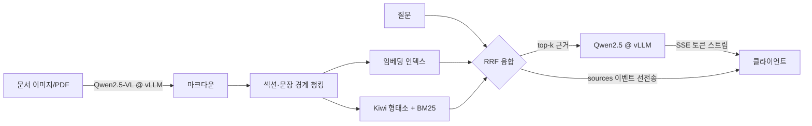

# KoDoc — 한국어 문서 이해 RAG 서비스

문서 이미지를 VLM으로 구조까지 읽어내고, 형태소 분석 기반 하이브리드 검색으로 근거를 찾아,
vLLM 위에서 스트리밍으로 답하는 **한국어 특화 문서 질의응답 서비스**입니다.

> LLM/VLM 연구·개발, 모델 서빙·추론 최적화, 한국어 NLP — 세 가지를 하나의 동작하는
> 시스템으로 묶는 것이 목표였습니다. 모든 설계 결정에는 [근거](docs/ARCHITECTURE.md)가 있고,
> 검색 품질은 [평가 스크립트](eval/run_eval.py)로, 서빙 성능은 [벤치마크 도구](benchmarks/)로
> 재현 가능하게 측정합니다.

## 핵심 기능

- **VLM 문서 파싱** — Qwen2.5-VL로 문서 이미지/PDF를 표 구조까지 보존한 마크다운으로 변환
  (`kodoc.parsing`). OCR 다단계 파이프라인 없이 단일 모델 호출로 처리.
  파싱 모델을 바꿔가며 정답 대조까지 해본 기록은 [docs/vlm-comparison.md](docs/vlm-comparison.md).
- **한국어 하이브리드 검색** — Kiwi 형태소 분석으로 조사·어미를 제거한 BM25(직접 구현)와
  임베딩 검색을 RRF(Cormack et al., SIGIR 2009)로 융합. 교착어인 한국어에서 어절 단위
  BM25가 무너지는 문제를 실측(어절 hit@1 0.722 → 형태소 1.000)으로 확인하고 해결.
- **근거 기반 생성** — 검색된 청크만으로 답하고 `[1]` 형식으로 인용을 강제하는 프롬프트 계약.
  근거가 없으면 "찾을 수 없습니다"로 응답.
- **스트리밍 서비스** — FastAPI + SSE. 근거(sources)를 첫 이벤트로 선전송한 뒤 토큰을 스트리밍해
  체감 대기시간을 최소화.
- **서빙 최적화 도구** — TTFT/TPOT/처리량을 동시성 수준별로 측정하는 부하 벤치마크.
  T4에서 FP16 vs AWQ를 실측해 decode가 메모리 대역폭에 묶인다는 것을 곡선으로 확인
  (배치 16배 증가에도 스텝 시간 불변, [실측 분석](docs/serving-benchmark.md)).

## 아키텍처



설계 결정의 이유와 트레이드오프는 [docs/ARCHITECTURE.md](docs/ARCHITECTURE.md),
추론 최적화 원리 정리는 [docs/inference-optimization.md](docs/inference-optimization.md),
모델 선정 근거와 검증 절차는 [docs/model-selection.md](docs/model-selection.md),
VLM 파싱 모델 실측 비교는 [docs/vlm-comparison.md](docs/vlm-comparison.md),
서빙 벤치마크 실측과 해석은 [docs/serving-benchmark.md](docs/serving-benchmark.md) 참고.

## 검색 품질 평가

`eval/run_eval.py`가 동일 평가셋으로 어절 BM25 / 형태소 BM25 / dense / hybrid를 비교합니다.
아래는 의존성 없는 `hash` 임베더(문자 trigram) 기준 실측값입니다.

> 규모 고지: 단일 문서(8청크) · 질문 18개의 **스모크 평가**입니다. 랭커 간 상대 비교에는
> 유효하지만 절대 수치를 일반화할 규모는 아닙니다 — 평가셋 확장이 로드맵 1순위인 이유.

| mode | hit@1 | hit@3 | hit@5 | mrr@10 |
|------|-------|-------|-------|--------|
| bm25 (어절 토큰) | 0.722 | 0.722 | 0.722 | 0.722 |
| bm25 (Kiwi 형태소) | 1.000 | 1.000 | 1.000 | 1.000 |
| dense (hash) | 0.556 | 0.833 | 0.944 | 0.710 |
| hybrid | 0.889 | 1.000 | 1.000 | 0.944 |

이 표가 설계 결정 두 개를 검증합니다:

1. **형태소 분석의 효과** — 같은 BM25에서 토크나이저만 어절→형태소로 바꿔도 hit@1이
   0.722→1.000으로 오릅니다. 조사·어미가 붙는 한국어에서 "온도를"과 "온도"를 같은
   토큰으로 묶는 기본기가 검색 품질의 바닥을 결정합니다.
2. **하이브리드는 임베더 검증 후에** — 용어가 문서와 겹치는 매뉴얼 도메인에서는 형태소
   BM25가 이미 강력해서, 약한 임베더를 섞으면 hit@1이 오히려 내려갑니다(1.000→0.889).
   `bge-m3` 같은 검증된 임베더로 교체(`KODOC_EMBEDDER=bge-m3`)한 뒤 같은 스크립트로
   재측정해 패러프레이즈 질의에서의 이득을 확인하는 것이 올바른 운영 절차입니다.

## 서빙 성능 벤치마크

```bash
python benchmarks/bench_serving.py \
  --base-url http://localhost:8000/v1 --model Qwen/Qwen2.5-7B-Instruct-AWQ \
  --num-requests 64 --concurrency 1 8 32 --max-tokens 256
```

TTFT(p50/p95), TPOT, tok/s, req/s를 동시성 수준별로 측정합니다. 결과 JSON에는
GPU·드라이버·vLLM/torch 버전이 자동으로 함께 기록됩니다 — 환경 정보 없는 벤치마크
수치는 해석도 재현도 불가능하기 때문입니다.

### 실측 (Tesla T4 / 드라이버 580.159.04 / vLLM 0.26.0 / Qwen2.5-3B)

| 구성 | 동시성 | tok/s | TTFT p50/p95 (ms) | TPOT p50 (ms) |
|---|---|---|---|---|
| FP16 | 1 | 27.2 | 45.4 / 79.8 | 37.07 |
| FP16 | 16 | 326.3 | 134.9 / 149.2 | 35.90 |
| FP16 | 64 | 1010.8 | 336.6 / 382.5 | 54.46 |
| AWQ | 1 | 77.6 | 34.7 / 39.7 | **12.76** |
| AWQ | 16 | 542.9 | 94.1 / 117.0 | 18.34 |
| AWQ | 64 | 1320.0 | 277.0 / 359.1 | 41.76 |

**FP16에서 배치가 1→16으로 16배 늘어도 스텝 시간은 37.07→35.90ms로 거의 그대로인데
처리량은 12배가 됩니다.** 스텝마다 가중치를 HBM에서 읽는 비용이 배치 크기와 무관하게
고정이기 때문입니다 — decode가 메모리 대역폭에 묶여 있다는 것의 직접적인 관측입니다.
같은 이유로 AWQ의 배치 1 TPOT 개선(2.91배)이 읽는 바이트 수 감소분에 거의 정확히
비례했고, **동시성이 오를수록 그 이득은 2.91→1.30배로 줄어듭니다.**

측정 전에 세운 가설 3개 중 **1개 확인 · 1개 반증 · 1개 미검증**입니다. 반증된 가설
(짧은 프롬프트의 prefill도 대역폭 bound다)과 그 함의를 포함한 전체 분석은
[docs/serving-benchmark.md](docs/serving-benchmark.md), 원본 JSON은
[benchmarks/results/](benchmarks/results/)에 있습니다.
실험 시나리오는 [benchmarks/README.md](benchmarks/README.md) 참고.

## 빠른 시작

### 1) GPU 없이 — 검색 파이프라인 데모 (30초)

```bash
pip install -e ".[dev,korean]"
kodoc ingest data/samples/smartfarm_manual.md --index-dir ./index
kodoc search "양액 EC 적정 범위" --index-dir ./index
python eval/run_eval.py   # 검색 품질 평가표 출력
pytest -q                 # 60개 테스트 (LLM 서버 불필요, 전부 오프라인)
```

### 2) LLM 연결 — 전체 서비스

```bash
# GPU 서버에서 (또는 아무 OpenAI 호환 엔드포인트를 .env에 지정)
bash scripts/serve_llm.sh          # vLLM: Qwen2.5-7B-Instruct-AWQ @ :8000

# API 서버
cp .env.example .env               # 필요 시 엔드포인트 수정
kodoc serve --port 9000
# KODOC_INDEX_DIR(기본 ./index)에 저장된 인덱스를 기동 시 복원하므로,
# 위에서 kodoc ingest로 색인한 문서가 그대로 서비스됩니다. API로 등록한
# 문서도 같은 경로에 저장되어 재시작 후 유지됩니다.
```

```bash
# 문서 등록
curl -X POST localhost:9000/documents/file -F "file=@data/samples/smartfarm_manual.md"

# 질의 (SSE 스트리밍)
curl -N -X POST localhost:9000/ask/stream \
  -H "Content-Type: application/json" \
  -d '{"question": "고온 경보는 언제 발령되나요?"}'
```

### 3) VLM 문서 파싱까지

```bash
bash scripts/serve_vlm.sh          # vLLM: Qwen2.5-VL-7B-Instruct @ :8001
python - <<'EOF'
import asyncio
from kodoc.service.deps import build_vlm_parser

async def main():
    parser = build_vlm_parser()      # 설정에서 base_url/model/key/temperature를 읽는다
    markdown = await parser.parse_image_file("scan.png")
    print(markdown)
    await parser.aclose()

asyncio.run(main())
EOF
```

## API

| 메서드 | 경로 | 설명 |
|---|---|---|
| GET | `/healthz` | 상태 + 색인된 청크 수 |
| POST | `/documents` | 텍스트/마크다운 색인 |
| POST | `/documents/file` | 파일 업로드 색인 (.md/.txt) |
| POST | `/search` | 검색만 (mode: hybrid/dense/bm25) — 디버깅·평가용 |
| POST | `/ask` | RAG 질의응답 |
| POST | `/ask/stream` | SSE 스트리밍 질의응답 (sources → token* → done, 실패 시 error 이벤트) |

## 프로젝트 구조

```
src/kodoc/
├── parsing/      # VLM 문서 파싱 (이미지/PDF → 마크다운)
├── rag/          # 청킹, 형태소 토크나이저, BM25(직접 구현), 임베더, 벡터 스토어, 하이브리드 검색
├── llm/          # OpenAI 호환 클라이언트(스트리밍), RAG 프롬프트
├── service/      # FastAPI, SSE, 스키마
├── pipeline.py   # 인제스트 → 검색 → 생성 오케스트레이션
└── cli.py        # kodoc ingest/search/serve
benchmarks/       # 서빙 부하 벤치마크 (TTFT/TPOT/처리량) + 실측 결과
eval/             # 검색 품질 평가 (hit@k, MRR) — 어절/형태소/dense/hybrid 비교
finetune/         # 작은 모델에 RAG 형식 계약 학습 — 데이터 생성·검증, 규칙 기반 채점
docs/             # 아키텍처 / 추론 최적화 / 모델 선정 / 실측 분석
tests/            # 60개 테스트 — 외부 서버·GPU 없이 전부 실행 가능
```

## 테스트 철학

무거운 의존성(torch, GPU, LLM 서버)이 없어도 **로직 전체가 테스트되도록** 경계를 설계했습니다.
LLM/VLM은 프로토콜만 맞춘 대역(fake)으로, 임베딩은 결정적 hash 임베더로 대체합니다.
동시 색인 정합성, SSE 오류 이벤트 같은 서비스 엣지 케이스도 회귀 테스트로 고정했습니다.
CI(GitHub Actions)는 Python 3.10/3.11/3.12에서 린트+테스트를 돌립니다.

## 로드맵

- [ ] 평가셋 확장: 패러프레이즈·복합 질의 추가 — 현재 검색 평가는 스모크 규모이며,
      하이브리드/리랭커의 가치 판단은 이 확장이 선행되어야 함
      (미근거 질문(unanswerable)은 [finetune/](finetune/)의 형식 평가셋에서 일부 확보)
- [ ] bge-reranker-v2-m3 리랭킹 단계 (RRF top-20 → cross-encoder → top-5)
- [ ] 답변 인용 검증기 (인용된 청크가 실제 근거인지 NLI로 검증)
- [ ] 임베딩 별도 서빙(TEI) 분리로 서비스 컨테이너 완전 torch-free화
- [ ] vLLM guided decoding 기반 JSON 응답 모드

## 라이선스

MIT
