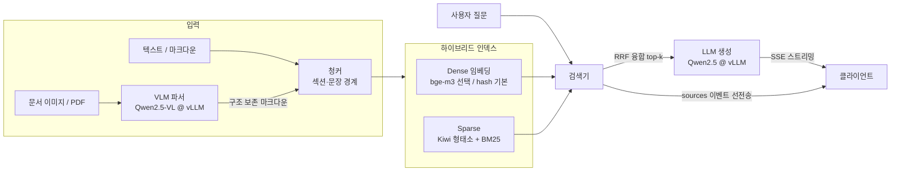

# 아키텍처

## 전체 구조

## 계층 설명

| 계층 | 모듈 | 책임 |
|---|---|---|
| 파싱 | `kodoc.parsing` | 문서 이미지/PDF → 마크다운 (VLM, OpenAI 호환 API 경유) |
| 색인 | `kodoc.rag.chunker/embedder/bm25/store` | 청킹, 임베딩, 역색인, 영속화 |
| 검색 | `kodoc.rag.retriever` | dense + sparse 랭킹, RRF 융합 |
| 생성 | `kodoc.llm` | OpenAI 호환 클라이언트, RAG 프롬프트, 스트리밍 |
| 서비스 | `kodoc.service` | FastAPI, SSE, 스키마 검증 |
| 조율 | `kodoc.pipeline` | 인제스트→검색→생성 오케스트레이션 |

## 핵심 설계 결정과 트레이드오프

### 1. 추론 엔진과 서비스 코드의 분리 (OpenAI 호환 API)

LLM/VLM 호출을 전부 OpenAI 호환 API로 통일했다. 기본 구성(모델 호출은 전부
원격, 임베더는 hash)에서는 서비스 컨테이너에 torch가 없고, GPU 서버(vLLM)는
독립적으로 스케일/교체된다.

- 얻는 것: 엔진 교체 자유(vLLM↔TGI↔상용 API), torch 없는 경량 서비스 이미지,
  벤치마크 코드 재사용.
- 잃는 것: 엔진 내부 기능(guided decoding 등)을 쓰려면 API 확장 필드에 의존해야 한다.
- 예외 하나를 정직하게 적어두면: 질의 시점 임베딩은 서비스 프로세스 안에서 돈다.
  `bge-m3`를 선택하면 embeddings extra(torch 포함)가 서비스 쪽에 필요해진다 —
  완전한 torch-free를 유지하려면 임베딩도 별도 서빙(TEI 등)으로 분리하는 것이
  다음 단계다 (로드맵).

**호환의 한계 — 직접 부딪혀 배운 것.** "OpenAI 호환"은 엔드포인트와 스키마가 같다는
뜻이지 지원 파라미터까지 같다는 뜻은 아니다. 같은 코드로 모델만 바꿔 파싱을 돌려보다가
최신 Claude 모델(`claude-sonnet-5` 등)이 `temperature`를 받으면 400을 돌려준다는 걸
발견했다. 구형 모델은 받아주기 때문에 모델을 바꾸는 순간에만 드러나는 종류의 문제다.
그래서 **선택적 파라미터는 설정에서 비울 수 있게 하고, 비면 요청 본문에서 아예 제외**하도록
바꿨다(`Settings.llm_temperature` / `vlm_temperature`가 `float | None`, 빈 문자열은
`None`으로 해석, `LLMClient._payload`가 None인 필드를 제외). 교체 가능성을 주장하려면
교체를 실제로 해봐야 한다는 걸 확인한 사례다.

### 2. 형태소 분석 기반 BM25 + dense의 하이브리드

한국어는 교착어라 어절 단위 BM25가 무력하다("온도를"≠"온도"). Kiwi로 조사·어미를
제거한 내용어 기반 BM25를 만들고, 패러프레이즈에 강한 dense 검색과 RRF로 융합했다.

- RRF를 고른 이유: 점수 정규화가 필요 없고(rank만 사용), 두 랭커의 분포가 아무리
  달라도 안정적으로 동작한다. 가중합 방식은 임베더를 바꿀 때마다 가중치 재튜닝이
  필요해서 배제했다. (Cormack, Clarke & Buettcher, SIGIR 2009 — rrf_k=60은 논문 권장값)
- 검증: `eval/run_eval.py`가 어절 BM25 / 형태소 BM25 / dense / hybrid를 같은
  평가셋으로 비교한다. 형태소 분석 도입의 효과가 수치로 확인된다
  (같은 BM25에서 어절 토큰 hit@1 0.722 → 형태소 토큰 1.000, 스모크 평가 기준).

### 3. 문장·섹션 경계 청킹 (고정 길이 슬라이딩 윈도우 대신)

문장을 중간에 자르면 임베딩 품질과 인용 정확도가 함께 떨어진다. 섹션 제목을
청크에 `[제목]`으로 프리픽스해서, 본문에 표제어가 반복되지 않는 매뉴얼류 문서의
검색 재현율을 끌어올렸다.

### 4. numpy 브루트포스 벡터 검색 (FAISS 대신)

수만 청크 이하에서 정규화 내적의 브루트포스는 밀리초 단위다. ANN 인덱스는
빌드/튜닝 복잡도를 더하는 대신 이 규모에서 이득이 없다. `VectorStore` 인터페이스를
좁게 유지해서(add/search/save/load) 규모가 커지면 FAISS로 갈아끼우면 된다.
"필요해지기 전까지 인프라를 들이지 않는다"는 판단 자체가 설계의 일부다.

### 5. SSE에서 sources를 첫 이벤트로 선전송

검색은 수십 ms, 생성은 수 초다. 근거 문서를 먼저 내려보내면 사용자는 LLM이
생성을 시작하기 전에 "무엇을 근거로 답할지"를 본다. 체감 대기시간이 줄고,
스트리밍 중간에 근거를 붙이는 프런트엔드 복잡도도 사라진다.

### 6. 할루시네이션 억제를 프롬프트 계약으로

시스템 프롬프트가 (a) 컨텍스트 외 지식 사용 금지, (b) 근거 번호 인용 의무,
(c) 근거 없으면 "찾을 수 없습니다" 고정 응답을 강제한다. 인용 번호가 기계 검증
가능한 형식이라 후처리 검증 훅을 붙일 수 있는 구조다.

## 확장 로드맵 (면접 논의용)

- 평가셋 확장: 패러프레이즈·복합·미근거(unanswerable) 질의 추가 — 현재 평가는
  단일 문서 스모크 규모라, 하이브리드/리랭커의 가치는 이 확장 후에 판단 가능
- 리랭커(bge-reranker-v2-m3) 단계 추가: RRF top-20 → cross-encoder → top-5
- 임베딩 별도 서빙(TEI 등) 분리로 서비스 컨테이너 완전 torch-free화
- 멀티 문서·메타데이터 필터(문서 타입/날짜) 지원
- 인용 검증기: 답변의 [n] 인용이 실제 해당 청크에 근거하는지 NLI로 검증
- vLLM guided decoding으로 JSON 모드 응답 지원
